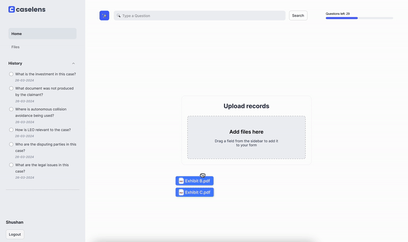

# Event-Based Case Chronology Generation


## Overview
Addressing the critical need within the legal profession, this project aims to develop a solution for efficiently analyzing vast volumes of legal documents. Lawyers often spend weeks aggregating evidence from numerous submissions to construct a chronological timeline of events relevant to a case, and in some cases, there can be thousands or even millions of documents to process. Hence, I propose developing a tool that will enable lawyers to upload case-related documents and get a chronological timeline of events related to the case, associating each event with its corresponding documents so they can easily refer to the source document. With the proposed tool, this time-consuming task will be streamlined into a fast and efficient process, analyzing documents within minutes instead of weeks. I believe this tool can be scaled to serve not only legal professionals but also various other fields that require efficient document analysis.

For a detailed explanation, you can view the [presentation](https://pitch.com/v/event-based-case-chronology-generation-254cwn).

## Features
- **Document Text Extraction:** Split PDF file into separate documents to match real-life use cases.
- **Timeline Generation:** Analyze the readable and non-readable documents to construct a chronological timeline of events.

## Data
The data used for the **Proof of Concept (PoC)** of the Timeline Generation idea is sourced from the **FDI Moot, an international competition focused on investment arbitration**, which simulates investment treaty arbitration proceedings.

## Installation
Ensure you have an environment with Python 3.10 installed on your machine. You can then install the required dependencies via pip:

```bash
pip install -r requirements.txt
```

## Usage
1. **Set Up Your API Key:** Before running the scripts, ensure your OpenAI API key is set up in the script:

    ```python
    openai.api_key = 'YOUR-OPENAI-KEY'
    ```

2. **Prepare Your Data:** Organize your PDF files into a directory named `Data/pdfs` and subfolders named after each case, such as `fdi_moot_case_2024`.

3. **Run the Extraction Script:** Execute the main script in `Notebooks/Timeline_Generation.ipynb` to extract the chronological timeline of events from readable and non-readable documents.

## License
This project is licensed under the MIT License.